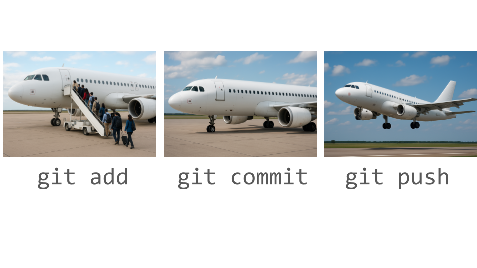
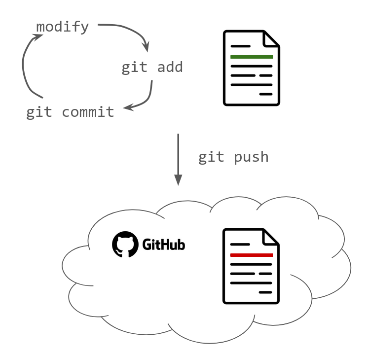
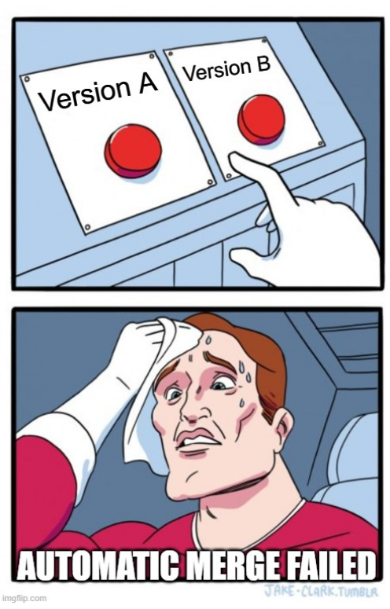

# Git para trabajar individualmente

------------------------------------------------------------------------

## Sobre este taller

::::: columns
::: {.column width="40%"}
-   Por qué usar git
-   Cómo usar git (y GitHub)
-   Cómo trabajar con git en el contexto de escribir código R
-   Cómo colaborar con otras personas.
:::

::: {.column width="60%"}
```{r}
#| echo: false
#| fig-alt: "Ilustración de Alison Horst que muestra el directorio de trabajo (como un edificio), cómo se añaden los archivos al área de preparación (staging) y se envían al repositorio local (otro edificio). Los envíos se transfieren y se extraen del repositorio remoto (un edificio diferente), todos conectados con flechas."

knitr::include_graphics("https://cdn.myportfolio.com/45214904-6a61-4e23-98d6-b140f8654a40/68739659-fb6f-41e8-9813-32e1de3d82c0_rw_1920.png?h=4b046efe7664ab833358c241b10bd8e6")
```
:::
:::::

------------------------------------------------------------------------

Tienen algo asi en su computadora?

```         
/home/pao/Documents/thesis
├── resumen.R
├── tesis.Rmd
├── tesis_revisada.Rmd
├── tesis_revisada2.Rmd
├── tesis_final.Rmd
├── tesis_finalfinal.Rmd
├── esta_es_la_final.Rmd
├── ahora_si_esta_es_la_final_en_serio_definitivo.Rmd
└── FINAL.Rmd
```

------------------------------------------------------------------------

## Ciclo del control de versiones


------------------------------------------------------------------------

## Nuestro flujo de trabajo


## `add --> commmit --> push`



## Chequear que todo esta listo

``` r
> usethis::git_sitrep()

── Git global (user) 
• Name: "Pao Corrales"
• Email: "micorreo@gmail.com"
• Global (user-level) gitignore file: ~/.gitignore
• Vaccinated: TRUE
• Default Git protocol: "https"
• Default initial branch name: "main"

── GitHub user 
• Default GitHub host: "https://github.com"
• Personal access token for "https://github.com": <discovered>
• GitHub user: "paocorrales"
• Token scopes: "gist", "repo", "user", and "workflow"
• Email(s): "micorreo@gmail.com (primary)", "paocorrales@users.noreply.github.com", and
  "otro correo@gmail.com"
ℹ No active usethis project.
```

## Usando git y GitHub con RStudio

Supongamos que estas arrancando un nuevo proyecto:

1.  Crea un nuevo proyecto de RStudio

    -   `File \> New Project \> New Directory \> New Project`. **No** selecciones la opcion "Create a new git repository".

2.  Usa `usethis::use_git()` para asegurarte que el proyecto tiene un repositorio git.

3.  Usa la funcion `usethis::use_github()` para asociar el repositorio local con un repositorio remoto en GitHub.

4.  Chequea en tu GitHub que el nuevo repo con el nombre del proyecto exista.

# Trabajando en proyectos que tienen control de versiones

## ✏️ Trabajando en el repo local

1.  Creá un nuevo archivo (script, rmarkdown o quarto) y guardalo.
2.  Agregalo al área de preparación con *add* y luego hace un *commit*. ¡Vas a tener que pensar un mensaje descriptivo!
3.  Hace un cambio en el archivo, puede ser cualquier cosa. Guardalo.
4.  Repetí el paso 2.
5.  Ahora, hacé *push* para enviar los commits al repositorio remoto utilizando el botón con la flecha verde apuntando hacia arriba.
6.  En el repositorio remoto chequea que los cambios estén presentes en el archivo.

## ✏️ Haciendo cambios remotos

1.  En GitHub navegá hasta encontrar el archivo que creaste recién. Entrá y hace click en el lapiz ("Edit this file") para editarlo.
2.  Agregá un par de lineas de código o texto.
3.  Arriba a la derecha encontrarás un botón verde que dice "Commit changes...".
4.  Edita el mensaje del commit para que sea informativo y luego hace clic en "Commit changes"
5.  Revisá si los cambios se guardaron correctamente.

## ✏️ Sincronizando el repo remoto con el repo local

1.  Volvé a RStudio.
2.  Revisá panel de Git.
3.  Hacé click en la flecha azul que dice "Pull".
4.  Revisá el archivo que modificaste en GitHub.

# Git para trabajar en equipo

## Objetivos de hoy

-   Aplicar conceptos de flujos de trabajo colaborativo usando Git y GitHub.
-   Comprender como los conflictos de versiones se generan y como resolverlos.
-   Identificar las diferencias entre branchs y forks e identificar situaciones en las que utilizar cada una.
-   Comprender el uso y el rol de las branchs y los pull requests en la colaboración en un proyecto.
-   Gestiona pull requests como responsable o líder de un proyecto.

## Conflictos de merge


::::: {.columns}


::: {.column width="60%" .fragment}

:::

::: {.column width="40%" .fragment}

:::
:::::

## Estrategias al trabajar en equipo

::::: {.columns}


:::: {.column width="50%" .fragment}

::: {.incremental}

1. `pull` antes de arrancar a trabjar
2. Cada persona trabaja en archivos distintos
3. Las personas se turnan para modificar el mismo archivo
4. Las personas trabajan con branchs: **Una versión paralela de los archivos en el repo**

:::

::::

:::: {.column width="50%" .fragment}

::::

:::::

## Escenario 1: Usamos branchs

:::: {.columns}
::: {.column width="60%"}


::: 

::: {.column width="40%"}

1.  Cloná el repositorio en tu computadora
2.  Crear una nueva _branch_.
3.  Edita archivos, agregalos y hacé commits en esa _branch._
4.  Envía un _pull request_ al
    repositorio remoto para comparar tus cambios en tu _branch_ con main.
5.  El _pull request_ es aceptado y se hace _merge_ o hay que hacer nuevos
    cambios (vuelve al paso 3).

:::
::::


## Escenario 2: Usamos forks y branchs

:::: {.columns}
::: {.column width="60%"}


::: 

::: {.column width="40%"}

1.  Crear un fork del repositorio principal  
2.  Cloná el repositorio en tu computadora
3.  Crear una nueva _branch_.
4.  Edita archivos, agregalos y hacé commits en esa _branch._
5.  Envía un _pull request_ al
    repositorio remoto para comparar tus cambios en tu _branch_ con main.
6.  El _pull request_ es aceptado y se hace _merge_ o hay que hacer nuevos
    cambios (vuelve al paso 3).

:::
::::

## ✏️ Plantemos árboles


